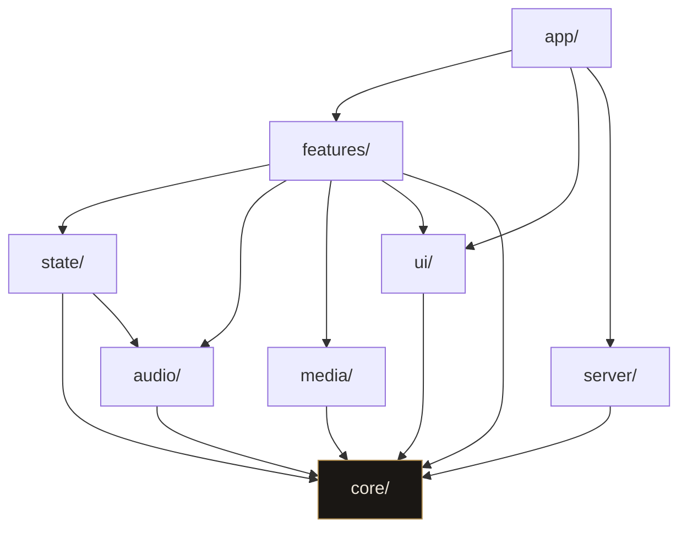

# Arquitectura

## La idea en una frase

La teoría musical no sabe que existe un navegador, y la interfaz no sabe cómo
se calcula un acorde. Todo lo demás es consecuencia de eso.

## Las capas

```
src/
  core/       teoría musical y planes, en TypeScript puro
  audio/      adaptadores Web Audio: captura, motor de tono, síntesis
  media/      micrófono para grabar, grabación a fichero
  server/     base de datos, sesión de cuenta y cupos: solo corre en el servidor
  state/      store de sesión (Zustand), cuenta y selectores
  features/   cada bloque de interfaz con su lógica
  ui/         primitivas y tokens de diseño
  app/        rutas de Next, pantallas y route handlers
```

### `core/`

Tres carpetas: `core/music/` con la teoría, `core/instrument/` con la guitarra
—afinación, trastes, qué nota da cada posición— y `core/billing/` con los planes.
El instrumento acabó aquí por la regla 3: lo necesitan el afinador y el mástil,
que son features distintos.

`core/billing/` es la tabla de qué incluye cada plan, y está en el dominio porque
la consultan las dos orillas: el navegador para pintar un candado y el servidor
para no gastar dinero. Preguntando los dos a la misma función no puede pasar que
la pantalla enseñe abierto lo que la ruta va a cerrar. La única flecha entre las
dos mitades del dominio va de `billing/` a `music/` —los planes saben qué es un
grado— y nunca al revés: la teoría musical no cambia según lo que pagues.

Sueltos en la raíz de `core/` hay tres ficheros que no son dominio musical pero
cumplen la misma regla —TypeScript y nada más—: `parse.ts`, `ai-errors.ts` y
`estado-observable.ts`. El último es la lista de apuntados que usan el micrófono
de `audio/`, el de `media/`, la grabadora y los dos motores de análisis; estaba
escrita cinco veces, y es un `Set` con un valor, así que no tiene por qué vivir
donde se usa.

Funciones puras sobre números y cadenas. Cero React, cero DOM, cero `window`,
cero `Date.now()`. Si algo necesita saber qué hora es, el instante entra por
parámetro: por eso `addPitchClass(histograma, nota, instante)` recibe el tiempo
en vez de leerlo.

Esto no es purismo. Es lo que permite probar la detección de tonalidad
simulando dos minutos de sesión en un test que tarda un milisegundo.

### `audio/` y `media/`

Adaptadores. Exponen interfaces (`AudioInput`, `PitchEngine`, `MicInput`,
`SessionRecorder`) y esconden `AudioContext`, `getUserMedia` y `MediaRecorder`.
Un componente pide un `PitchEngine`, se suscribe y recibe hercios; no construye
nunca un `AnalyserNode`.

**Las dos saben abrir el micrófono, pero no lo abren dos veces.** `audio/` lo
abre para analizar —mide el tono, saca el croma y no guarda nada— y `media/` para
grabar a fichero, y cada una puede vivir sin la otra: dejar de grabar no deja de
escuchar. Cuando las dos cosas pasan a la vez —componer tocando—, `audio/`
**presta su flujo** por el puerto `StreamSource` y `media/` graba sobre él, que
es lo que siempre pudo hacer: `SessionRecorder.start` **recibe** un `MediaStream`,
no lo pide. Dos `getUserMedia` sobre el mismo aparato son dos permisos y dos
pilotos, y en un iPhone el segundo puede quedarse con el dispositivo y dejar al
primero sin señal.

Prestar no es ceder: quien recibe el flujo no cierra las pistas. Las suelta quien
las abrió, al pararse. Y por eso, al parar de tocar, **se para el grabador antes
que la escucha**: al revés, cerrar la entrada le cortaba la toma por el final.

Lo que `media/` ya no hace es vídeo: la cámara, la composición en canvas y el
overlay se fueron enteros ([adr/0023](./adr/0023-grabar-solo-el-sonido.md)).

### `server/`

La capa nueva, y la única que no puede tocar el navegador: la conexión a Postgres
con su esquema de Drizzle, la configuración de Auth.js, el cifrado de contraseñas,
el avance de la cuenta y los cupos de llamadas al modelo.

**Solo `app/` la abre.** Un import de `@server/` desde un componente arrastraría el
cliente de Postgres, Auth.js y —peor— la cadena de conexión al paquete que baja al
navegador. Lo vigila ESLint en las dos direcciones: `features/`, `state/` y `ui/`
no pueden importar de `@server/`, y `server/` no puede importar de las capas del
navegador. Lo que comparten sube a `core/`.

**Sin `DATABASE_URL` esta capa no hace nada y la aplicación funciona igual**, como
funciona sin `ANTHROPIC_API_KEY`: todo el mundo es anónimo, con plan gratis y el
avance en su navegador, que es como funcionaba antes de que existieran las cuentas.
`db()` devuelve nulo y cada función contesta con un resultado con nombre en vez de
reventar.

### `state/`

El estado de sesión vivo —qué nota suena, qué tonalidad se ha detectado— y la
configuración del banco de trabajo: qué paneles están abiertos y con qué
estilo. Zustand, no Context, por lo que se explica más abajo.

Aquí vive también `account.ts`, que es el único fichero del navegador que importa
`next-auth/react`: un feature que importase la librería de sesión quedaría atado a
ella, y así queda atado a `useAccount`. La cuenta no se pide con un `fetch` al
montar: la lee el layout en el servidor y baja por el proveedor, para que quien
entra pagando no vea medio segundo de candados antes de que se abran solos.

Aquí vive también `use-listening.ts`, que es lo que conecta la captura de audio
con el estado. Estaba dentro del afinador hasta que el botón de escuchar de la
barra lo necesitó también, y un feature no puede importar de otro: lo compartido
sube. Por eso `state/` depende de `audio/`, que es la única flecha que no baja
directamente a `core/`.

### `features/`

Un directorio por bloque: `tuner`, `wheel`, `fretboard`, `path`, `suggest`,
`learn`, `compose`, `ideas`, `recorder`, `sessions`, `account` —entrar, tarjetas de
plan, ventana de pago— y `workspace` —el botón del micro y los ajustes—. Cada uno tiene sus componentes y su lógica de
presentación, y ninguno conoce a los demás.

Quien los junta es `app/screens/`: una pantalla por fichero, y cada una mezcla
los features que necesita. Es el único sitio del proyecto donde eso puede pasar,
porque la composición es trabajo de la capa de arriba.

Cada pantalla tiene su dirección, y **cada cosa que se hace también**: `/aprender` es
el camino, `/aprender/[unidad]` es una unidad, `/aprender/repaso` una sesión de
repaso, `/profesor`, `/componer`, `/afinar`, `/planes`, `/planes/[plan]` la ventana de
pago de un plan, `/registro` para crear la cuenta, `/cuenta` los ajustes de la tuya, y
`/` la portada.

Fue una pantalla de tres columnas —temario, unidad y profesor— hasta que se vio lo que
eso hacía: con las tres cosas delante no se está en ninguna. El porqué del desglose y
del punto de partida está en
[adr/0007](./adr/0007-elegir-por-donde-empezar.md). En qué pantalla estás no vive en el store: lo dice la URL, que es lo
que permite enlazar una, volver atrás y tener el afinador abierto en una pestaña
mientras compones en otra. El store guarda lo que eliges —estilo, escala,
afinación—, que sí es tuyo y no de la página.

`metronome` es el ejemplo más claro de la regla de las capas: la aritmética del
tempo está en `core/`, el pulso —osciladores y relojes— en `audio/`, y el feature
solo pone botones. Así el tempo se prueba sin audio y el pulso se puede sustituir
por un doble en los tests de interfaz.

`recorder` **ya no envuelve nada**, y eso es lo que queda de una decisión: cuando
grababa vídeo tenía que ponerse por detrás de la pantalla entera con `children`
para que se te viera tocando, y con la cámara se fue esa forma
([adr/0023](./adr/0023-grabar-solo-el-sonido.md)). Hoy es un panel más del área de
abajo de componer, y quien graba el sonido mientras escribes tocando es
`state/use-tocar-y-apuntar.ts`, que abre las dos cosas con una sola pulsación.

### `ui/`

Botones, paneles, tipografía, tokens. Sin lógica de negocio.

## Quién puede importar a quién



Las flechas van siempre hacia abajo. Cinco reglas que no se saltan:

1. **`core/` no importa nada de las otras capas ni del navegador.** Si un test
   de `core/` necesita un `window`, la pieza está en el sitio equivocado.
   Lo vigila una regla de ESLint (`no-restricted-imports` sobre `src/core/**`).
2. **`audio/` y `media/` exponen interfaces que `features/` consume.** Nada de
   `AudioContext` suelto dentro de un componente.
3. **Un `feature` no importa de otro `feature`.** Lo compartido sube a `core/`,
   `ui/` o `state/`. También lo vigila ESLint.
4. **El audio del usuario no sale del dispositivo.** A la IA solo
   viajan símbolos: tonalidad, escala, nombres de notas, grado actual. Y a la base
   de datos, identificadores de unidad, números y fechas.
   Ver [AI.md](./AI.md) y [CUENTAS-Y-PLANES.md](./CUENTAS-Y-PLANES.md).
5. **`server/` solo lo abre `app/`, y `server/` no importa del navegador.** Es la
   regla que evita llevarse la cadena de conexión al bundle del cliente. También
   la vigila ESLint, y en los dos sentidos.

Los alias de `tsconfig.json` (`@core/*`, `@audio/*`, `@ui/*`...) existen para
que estas reglas se puedan escribir y leer de un vistazo.

## Notas para quien viene de Angular

Estas son las decisiones donde React y Next se comportan distinto a lo que
esperarías con Angular:

**No hay inyección de dependencias.** En Angular pedirías un `PitchService` en
el constructor y el framework te lo daría. Aquí no hay contenedor: las
interfaces de `audio/` se instancian explícitamente y se pasan como parámetro o
se guardan en el store. La ventaja es que un test no necesita `TestBed`, solo
pasar otra implementación.

**Zustand en vez de un servicio con `BehaviorSubject`.** El equivalente natural
de un servicio con estado observable sería React Context, pero Context vuelve a
renderizar _todos_ los consumidores cuando cambia cualquier parte del valor. Con
el afinador emitiendo veinte veces por segundo eso es inaceptable. Zustand
permite suscribirse a una porción (`useSessionStore(s => s.cents)`) y solo
re-renderiza a quien mira esa porción. Es lo más parecido a un selector de
NgRx que hay sin traer NgRx entero.

**Los componentes son funciones que se vuelven a ejecutar enteras.** No hay
`ngOnChanges` ni ciclo de vida por hooks de clase: cada render vuelve a
ejecutar el cuerpo del componente. Lo que debe sobrevivir entre renders va en
`useRef`; lo que debe provocar un render va en el store o en `useState`. Un
`AudioContext` guardado en una variable local se perdería en cada render, y por
eso vive en `audio/`, no en el componente.

**`useEffect` no es `ngOnInit`.** Se ejecuta después de pintar, puede
ejecutarse dos veces en desarrollo (modo estricto) y debe devolver su propia
limpieza. Todo lo que abre un recurso —micro, grabación— tiene que
cerrarse en ese `return`, o al recargar en caliente se quedan dos micrófonos
abiertos.

**Y un recurso que es único no puede vivir en un componente.** Es la otra mitad
de lo anterior y costó un fallo real. El micrófono lo abren dos botones —el del
afinador y el de la barra— y el estado de sesión es uno solo; con las
referencias dentro del gancho, cada componente tenía su copia y podía decir «he
parado» sin haber parado nada. Ahora la entrada, los motores y la suscripción
viven en el módulo de `state/use-listening.ts`, y lo que cuenta el componente es
**cuántos hay montados**: se suelta el aparato cuando no queda ninguno, no cuando
se va uno. Un `<button>` que abre un recurso compartido no es su dueño.

**Server components por defecto.** En Next con App Router, un componente se
renderiza en el servidor salvo que lleve `'use client'` en la primera línea.
Todo lo que toque `navigator`, `window` o un hook necesita esa marca.

El layout raíz es de servidor y lee la cuenta, y lleva `export const dynamic =
'force-dynamic'`. Sin eso, un `pnpm build` hecho sin `DATABASE_URL` deja las
páginas prerenderizadas con la cuenta anónima dentro y luego se sirve ese HTML
aunque al arrancar sí haya base de datos: es exactamente lo que pasa en el camino
del contenedor, donde se construye sin variables y se corre con ellas.

## Dónde vive cada decisión

- Por qué el dominio es puro: [adr/0001](./adr/0001-capas-y-dominio-puro.md)
- Por qué la detección de tono es propia: [adr/0002](./adr/0002-deteccion-de-tono-propia.md)
- Por qué el análisis corre en el hilo principal: [adr/0003](./adr/0003-analisis-en-el-hilo-principal.md)
- Por qué el avance de una cuenta se guarda en el servidor: [adr/0005](./adr/0005-cuentas-y-avance-en-servidor.md)
- Por qué la facturación es un puerto con un cobrador falso: [adr/0006](./adr/0006-planes-y-puerto-de-facturacion.md)
- Por qué se puede empezar por el nivel que quieras: [adr/0007](./adr/0007-elegir-por-donde-empezar.md)
- Qué da cada plan y qué se guarda de ti: [CUENTAS-Y-PLANES.md](./CUENTAS-Y-PLANES.md)
- Qué implementa el dominio, en lenguaje de músico: [DOMAIN-MUSIC.md](./DOMAIN-MUSIC.md)
- Cómo se detecta el tono: [AUDIO-PITCH.md](./AUDIO-PITCH.md)
- Cómo se graba: [RECORDING.md](./RECORDING.md)
- Contrato con el modelo: [AI.md](./AI.md)
- Qué falta: [ROADMAP.md](./ROADMAP.md)
