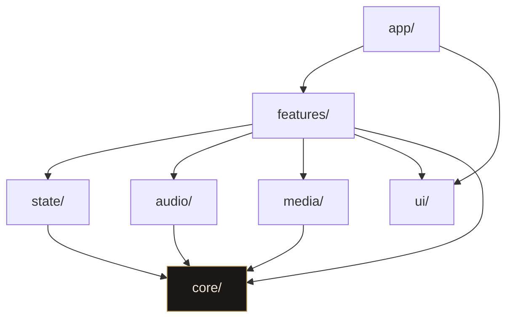

# Arquitectura

## La idea en una frase

La teoría musical no sabe que existe un navegador, y la interfaz no sabe cómo
se calcula un acorde. Todo lo demás es consecuencia de eso.

## Las capas

```
src/
  core/       teoría musical en TypeScript puro
  audio/      adaptadores Web Audio: captura, motor de tono, síntesis
  media/      cámara, composición en canvas, grabación
  state/      store de sesión (Zustand) y selectores
  features/   cada bloque de interfaz con su lógica
  ui/         primitivas y tokens de diseño
  app/        rutas de Next y el route handler de la IA
```

### `core/`

Funciones puras sobre números y cadenas. Cero React, cero DOM, cero `window`,
cero `Date.now()`. Si algo necesita saber qué hora es, el instante entra por
parámetro: por eso `addPitchClass(histograma, nota, instante)` recibe el tiempo
en vez de leerlo.

Esto no es purismo. Es lo que permite probar la detección de tonalidad
simulando dos minutos de sesión en un test que tarda un milisegundo.

### `audio/` y `media/`

Adaptadores. Exponen interfaces (`AudioInput`, `PitchEngine`, `CameraInput`,
`SessionRecorder`) y esconden `AudioContext`, `getUserMedia` y `MediaRecorder`.
Un componente pide un `PitchEngine`, se suscribe y recibe hercios; no construye
nunca un `AnalyserNode`.

### `state/`

El estado de sesión vivo: qué nota suena, qué tonalidad se ha detectado, qué
modo está activo. Zustand, no Context, por lo que se explica más abajo.

### `features/`

Un directorio por bloque: `tuner`, `wheel`, `fretboard`, `learn`, `compose`,
`ideas`, `recorder`. Cada uno tiene sus componentes y su lógica de presentación.

### `ui/`

Botones, paneles, tipografía, tokens. Sin lógica de negocio.

## Quién puede importar a quién



Las flechas van siempre hacia abajo. Cuatro reglas que no se saltan:

1. **`core/` no importa nada de las otras capas ni del navegador.** Si un test
   de `core/` necesita un `window`, la pieza está en el sitio equivocado.
   Lo vigila una regla de ESLint (`no-restricted-imports` sobre `src/core/**`).
2. **`audio/` y `media/` exponen interfaces que `features/` consume.** Nada de
   `AudioContext` suelto dentro de un componente.
3. **Un `feature` no importa de otro `feature`.** Lo compartido sube a `core/`,
   `ui/` o `state/`. También lo vigila ESLint.
4. **El audio y el vídeo del usuario no salen del dispositivo.** A la IA solo
   viajan símbolos: tonalidad, escala, nombres de notas, grado actual.
   Ver [AI.md](./AI.md).

Los alias de `tsconfig.json` (`@core/*`, `@audio/*`, `@ui/*`...) existen para
que estas reglas se puedan escribir y leer de un vistazo.

## Notas para quien viene de Angular

Estas son las decisiones donde React y Next se comportan distinto a lo que
esperarías con Angular:

**No hay inyección de dependencias.** En Angular pedirías un `PitchService` en
el constructor y el framework te lo daría. Aquí no hay contenedor: las
interfaces de `audio/` se instancian explícitamente y se pasan como parámetro o
se guardan en el store. La ventaja es que un test no necesita `TestBed`, solo
pasar otra implementación.

**Zustand en vez de un servicio con `BehaviorSubject`.** El equivalente natural
de un servicio con estado observable sería React Context, pero Context vuelve a
renderizar _todos_ los consumidores cuando cambia cualquier parte del valor. Con
el afinador emitiendo veinte veces por segundo eso es inaceptable. Zustand
permite suscribirse a una porción (`useSessionStore(s => s.cents)`) y solo
re-renderiza a quien mira esa porción. Es lo más parecido a un selector de
NgRx que hay sin traer NgRx entero.

**Los componentes son funciones que se vuelven a ejecutar enteras.** No hay
`ngOnChanges` ni ciclo de vida por hooks de clase: cada render vuelve a
ejecutar el cuerpo del componente. Lo que debe sobrevivir entre renders va en
`useRef`; lo que debe provocar un render va en el store o en `useState`. Un
`AudioContext` guardado en una variable local se perdería en cada render, y por
eso vive en `audio/`, no en el componente.

**`useEffect` no es `ngOnInit`.** Se ejecuta después de pintar, puede
ejecutarse dos veces en desarrollo (modo estricto) y debe devolver su propia
limpieza. Todo lo que abre un recurso —micro, cámara, grabación— tiene que
cerrarse en ese `return`, o al recargar en caliente se quedan dos micrófonos
abiertos.

**Server components por defecto.** En Next con App Router, un componente se
renderiza en el servidor salvo que lleve `'use client'` en la primera línea.
Todo lo que toque `navigator`, `window` o un hook necesita esa marca. La página
de inicio actual no la lleva: es HTML generado en build.

## Dónde vive cada decisión

- Por qué el dominio es puro: [adr/0001](./adr/0001-capas-y-dominio-puro.md)
- Por qué la detección de tono es propia: [adr/0002](./adr/0002-deteccion-de-tono-propia.md)
- Por qué el análisis corre en el hilo principal: [adr/0003](./adr/0003-analisis-en-el-hilo-principal.md)
- Qué implementa el dominio, en lenguaje de músico: [DOMAIN-MUSIC.md](./DOMAIN-MUSIC.md)
- Cómo se detecta el tono: [AUDIO-PITCH.md](./AUDIO-PITCH.md)
- Cómo se graba: [RECORDING.md](./RECORDING.md)
- Contrato con el modelo: [AI.md](./AI.md)
- Qué falta: [ROADMAP.md](./ROADMAP.md)
